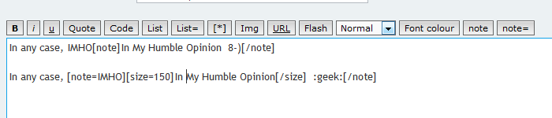
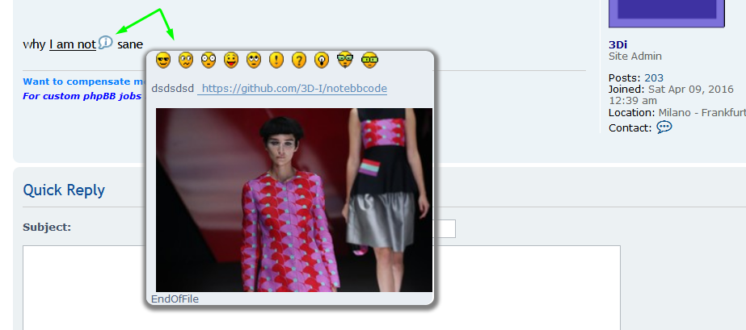

# notebbcode
The primenote MOD as an extension for phpBB3.1

Build Status: 

 Adds a Note BBCode, which displays a tooltip-like box containing text when the mouse is moved over the Note BBCode icon. The text inside the box can accept BBCodes, and the pop-up box will close automatically when the mouse is moved off the icon (unless the user clicks the icon, which will make the pop-up box stick in place until manually closed or until the cursor is moved a certain distance away from the pop-up box). Parses also smilies.BBcodes are automatically installed by the extension, no need to any manual input, just set to display on posting in ACP if you like.

## Usage

